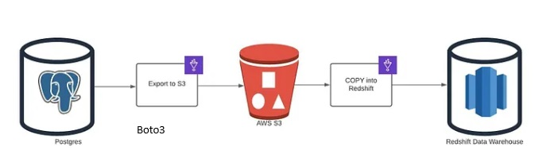
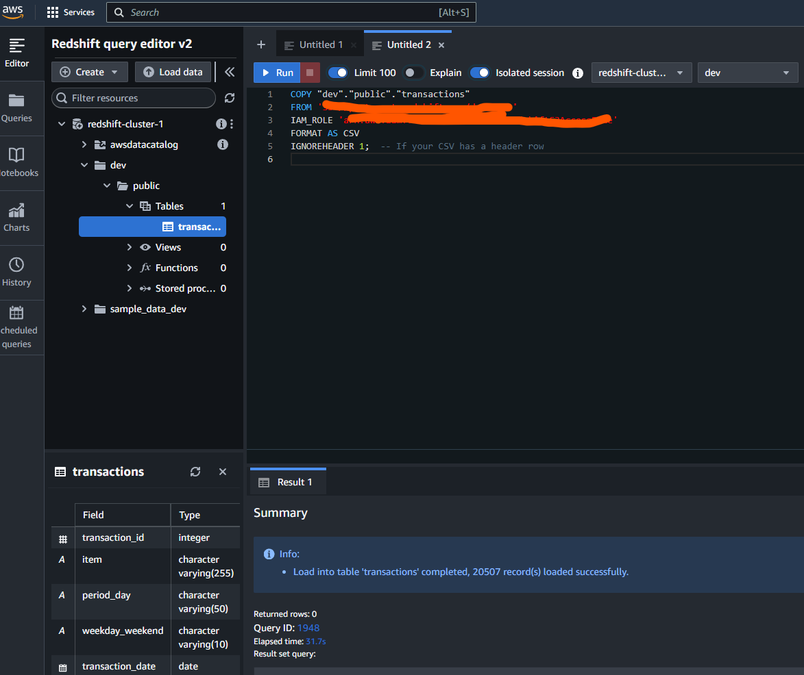
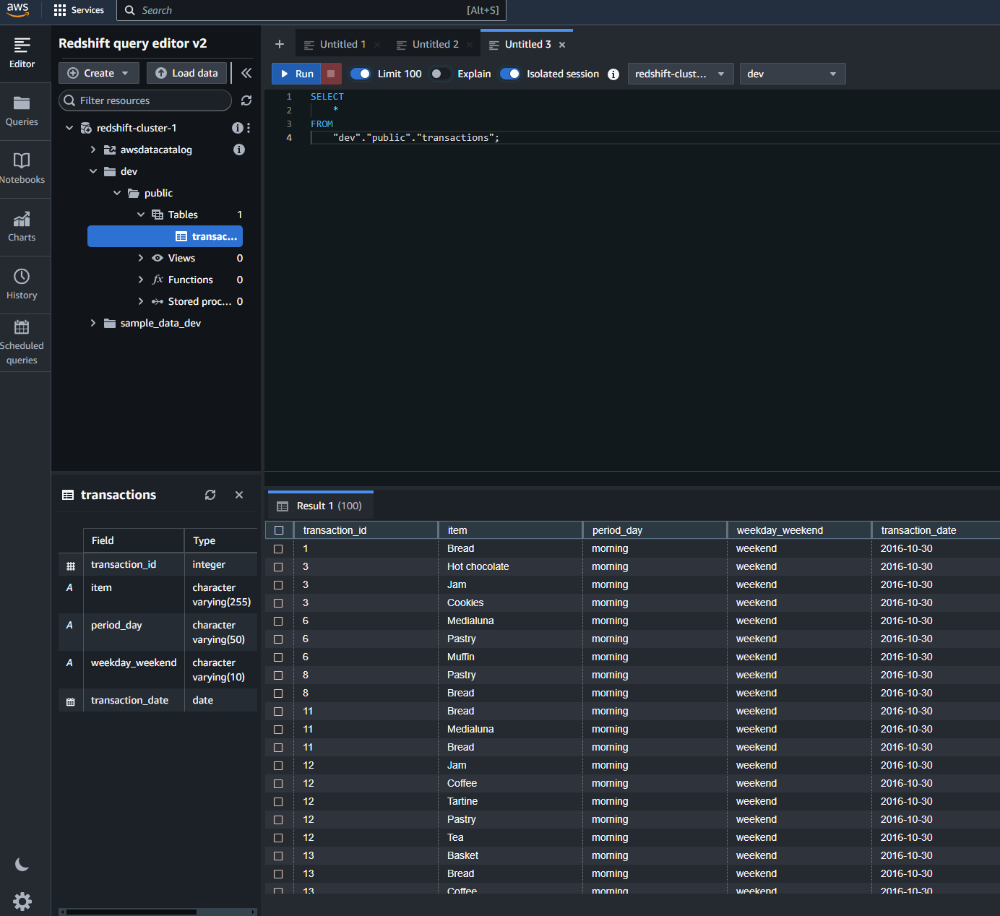

# PostgreSQL to Redshift Data Migration using Pandas

## Project Overview
This project demonstrates the process of migrating data from a PostgreSQL database to Amazon Redshift using the Pandas library in Python. The migration focuses on a **full load** approach, where all the data from the PostgreSQL database is extracted, transformed, and loaded into Amazon Redshift for analytics and reporting.

## Features
- **Data Extraction**: Connects to PostgreSQL and retrieves data using SQL queries.
- **Data Transformation**: Utilizes Pandas to manipulate and prepare data for loading.
- **Data Storage**: Saves the transformed data as CSV files in an Amazon S3 bucket.
- **Data Loading**: Loads the CSV files from S3 into Redshift using the `COPY` command.

## Sample Snippets
 
  
  

## Requirements
- Python 3.x
- Pandas
- Boto3
- psycopg2
- AWS Account (with S3 and Redshift access)

